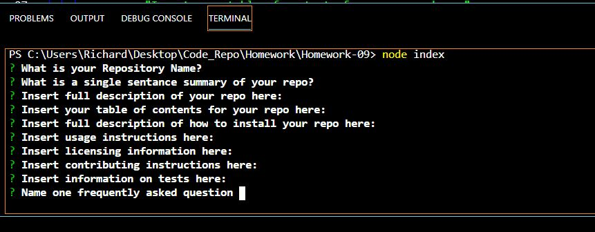

<html lang="en">
<head>
  <meta charset="UTF-8">
  <meta http-equiv="X-UA-Compatible" content="ie=edge">
  <link rel="stylesheet" href="https://maxcdn.bootstrapcdn.com/bootstrap/4.0.0/css/bootstrap.min.css">
  <title>Document</title>
</head>
<body>
  

  

    <h1 class="display-4"> Read.Me Generator</h1>
    
A simple way to generate a ReadMe.

    <h3>Description</h3>
        <ul class="list-group">
    <li class="list-group-item">This application allows for a user to generate a ReadMe file, the result of which can be placed in one's Github Repo ReadMe section</li>
    <h3>Table of Contents</h3>
       <ul class="list-group">
    <li class="list-group-item">Installation, Usage, License, Contributing, Tests, FAQs, Contact Info</li>
    <h3>Installation</h3>
       <ul class="list-group">
    <li class="list-group-item">Save the Index.js file along with the package.json file and the package-lock.json file.  In VS Code, download the extension Node.js.  Then open your terminal.  Make sure you are in the same folder that contains the other documents, enter "npm install"
      
      
      
    </li>
    <h3>Usage</h3>
    <ul class="list-group">
    <li class="list-group-item">While the terminal is open and you are in the same folder you installed the npm in, type "node index" and the prompt will run.  Answer the questions and fill out the descriptions as fully as you can.  At the end a file "index.html" will be generated.  Run that file in the browser to see the end result of your product.  If you have more information to add, append the index.html file within the index.html file or delete the index.html file and begin again</li>
    <h3>License</h3>
    <ul class="list-group">
      <li class="list-group-item">MIT License   https://github.com/twbs/bootstrap/blob/v4.0.0/LICENSE</li>
    <h3>Contributing</h3>
    <ul class="list-group">
    <li class="list-group-item">Richard B. Hall</li>
      <h3>Test   </h3>
    <ul class="list-group">
    <h3>Contact Info</h3>
        <ul class="list-group">
    <li class="list-group-item">Richardbrianhall@gmail.com</li>
    <li class="list-group-item">https://www.github.com/HallRB</li>
    <li class="list-group-item">https://www.linkedin.com/in/hallrb/</li>
    </ul>
  

</body>
</html>
